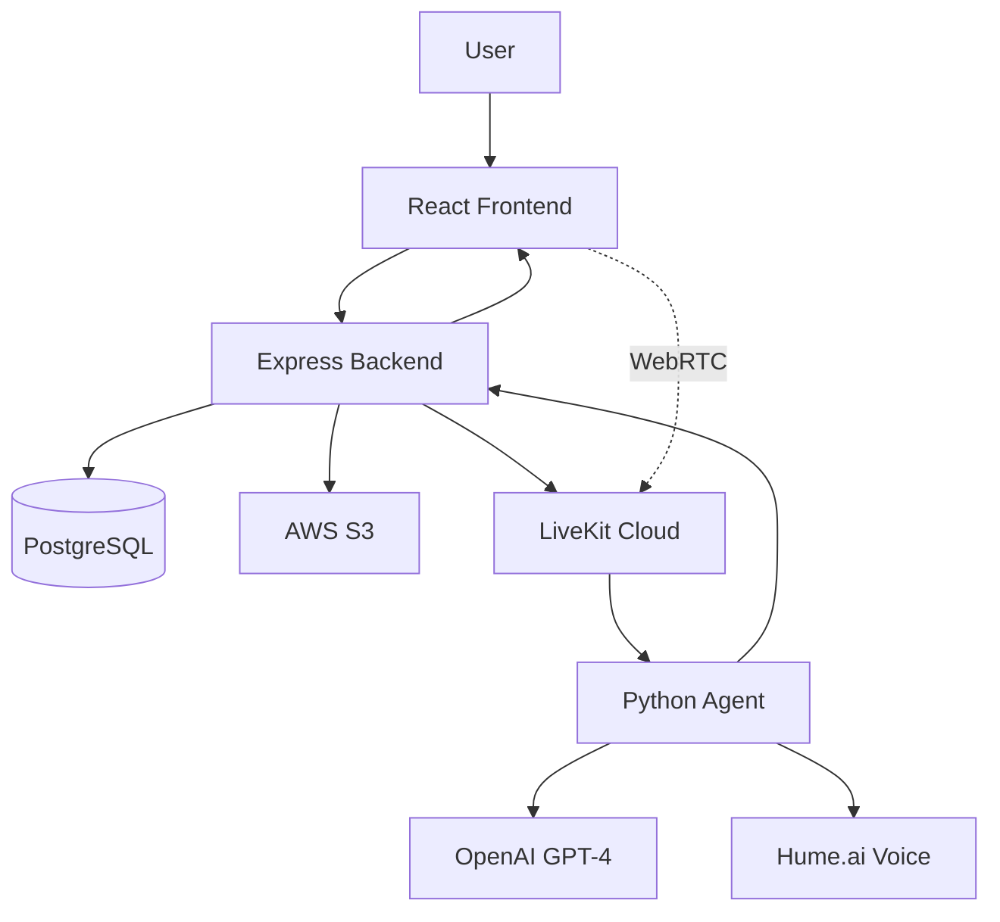

# Y Combinator Technical Deep Dive
## Digital Twin Voice Interview Platform - Technical Architecture & Implementation

---

## 🏗️ SYSTEM ARCHITECTURE

### Complete Tech Stack

#### Frontend (Client Layer)
```
React 18.3.1 + TypeScript 5.5.3
├── UI Framework: shadcn-ui (Radix UI + Tailwind CSS)
├── State Management: Zustand 4.4.0
├── Data Fetching: TanStack Query 5.56.2
├── Routing: React Router 6.26.2
├── Forms: React Hook Form 7.53.0 + Zod validation
├── Real-time:
│   ├── LiveKit Client SDK 2.15.11
│   ├── Hume Voice React 0.2.6
│   └── Socket.io Client 4.7.4
├── Build Tool: Vite 5.4.1
└── Deployment: Vercel/Netlify
```

#### Backend (API Layer)
```
Node.js + Express.js 4.18.2
├── Database: PostgreSQL + Prisma ORM 5.22.0
├── Authentication: JWT + bcrypt
├── File Storage: AWS S3 (via Multer)
├── Real-time:
│   ├── LiveKit Server SDK 2.14.0
│   └── WebSockets (ws 8.14.2)
├── AI Services:
│   ├── OpenAI SDK 4.20.1
│   ├── Hume.ai API
│   └── Text Kernel API
├── Security: Helmet, CORS, Rate Limiting
└── Deployment: Railway/Heroku
```

#### AI Agent Layer
```
Python 3.11 + UV
├── LiveKit Agents Framework
├── OpenAI Realtime API
├── Hume.ai TTS Integration
├── Custom Tools & Functions
└── Async Event Processing
```

### Data Flow Architecture



---

## 🔄 REAL-TIME INTERVIEW FLOW

### LiveKit Implementation

#### 1. Interview Initiation
```javascript
// backend/src/routes/livekit-interviews.js
async function startInterview(req, res) {
  // Generate room token
  const roomName = `interview_${uuidv4()}`;
  const at = new AccessToken(
    process.env.LIVEKIT_API_KEY,
    process.env.LIVEKIT_API_SECRET,
    {
      identity: candidateId,
      metadata: JSON.stringify({
        candidate_id: candidateId,
        interview_type: interviewType,
        experience_data: experienceData
      })
    }
  );

  at.addGrant({
    roomJoin: true,
    room: roomName,
    canPublish: true,
    canPublishData: true
  });

  // Dispatch agent to room
  await dispatchAgent(roomName, metadata);

  return { token: at.toJwt(), roomName };
}
```

#### 2. Agent Processing
```python
# livekit-agent/src/agent.py
@session.on("track_subscribed")
async def on_track_subscribed(track: Track):
    if track.kind == TrackKind.KIND_AUDIO:
        # Create transcription stream
        stream = openai.audio.transcriptions.create_stream(
            model="whisper-1",
            audio_stream=track
        )

        # Process with GPT-4
        async for text in stream:
            response = await generate_response(text)
            await speak_response(response)

async def generate_response(text: str):
    # Use context-aware generation
    context = await get_candidate_context()
    messages = [
        {"role": "system", "content": system_prompt},
        {"role": "assistant", "content": f"Context: {context}"},
        {"role": "user", "content": text}
    ]

    response = await openai.chat.completions.create(
        model="gpt-4",
        messages=messages,
        temperature=0.7,
        max_tokens=150
    )

    return response.choices[0].message.content
```

### Hume EVI Implementation

#### Voice Conversation Flow
```typescript
// src/services/directHumeEVISDK.ts
export class EVIInterview {
  private voiceClient: VoiceClient;
  private sessionId: string;

  async startInterview(config: InterviewConfig) {
    // Initialize Hume client
    this.voiceClient = new VoiceClient({
      apiKey: config.apiKey,
      configId: config.configId
    });

    // Setup event handlers
    this.voiceClient.on('message', this.handleMessage);
    this.voiceClient.on('audio', this.handleAudio);
    this.voiceClient.on('emotion', this.handleEmotion);

    // Connect with media stream
    const mediaStream = await navigator.mediaDevices.getUserMedia({
      audio: true
    });

    await this.voiceClient.connect({
      microphone: mediaStream
    });
  }

  private handleMessage = async (message: any) => {
    // Process and store conversation
    await fetch('/api/evi/messages', {
      method: 'POST',
      body: JSON.stringify({
        sessionId: this.sessionId,
        aiQuestion: message.text,
        timestamp: Date.now()
      })
    });
  }
}
```

---

## 🧠 AI IMPLEMENTATION DETAILS

### 1. Conversation State Management
```python
class ConversationMemory:
    def __init__(self, max_tokens=8000):
        self.messages = []
        self.max_tokens = max_tokens
        self.token_count = 0

    def add_message(self, role: str, content: str):
        tokens = self.count_tokens(content)

        # Implement sliding window if exceeding context
        while self.token_count + tokens > self.max_tokens:
            if self.messages:
                removed = self.messages.pop(0)
                self.token_count -= self.count_tokens(removed['content'])

        self.messages.append({'role': role, 'content': content})
        self.token_count += tokens

    def get_context(self):
        return self.messages[-10:]  # Keep last 10 exchanges
```

### 2. Dynamic Prompt Engineering
```python
def generate_system_prompt(interview_type, candidate_data):
    base_prompt = f"""You are {candidate_data['name']}, a {candidate_data['title']}.
    Your communication style should be: {analyze_communication_style(candidate_data)}
    """

    type_prompts = {
        'experience_enhancement': f"""
        Focus on specific achievements from your role at {candidate_data['company']}.
        Use STAR method (Situation, Task, Action, Result) when discussing projects.
        Quantify impact with metrics from: {candidate_data['achievements']}
        """,

        'technical_assessment': f"""
        Demonstrate deep knowledge of: {', '.join(candidate_data['skills'][:5])}
        Reference specific projects: {candidate_data['projects']}
        Be ready to discuss system design and architecture decisions.
        """
    }

    return base_prompt + type_prompts.get(interview_type, '')
```

### 3. Voice Synthesis Pipeline
```javascript
// Hume.ai voice configuration
const voiceConfig = {
  voice_id: selectedVoice,
  prosody: {
    speed: 1.0,
    pitch: 0,
    volume: 1.0
  },
  emotion_config: {
    empathy_level: 0.7,
    enthusiasm: 0.6,
    warmth: 0.8
  },
  language_model: {
    model: "claude-3-sonnet",
    temperature: 0.7,
    system_prompt: customPrompt
  }
};
```

---

## 🔐 SECURITY ARCHITECTURE

### Authentication Flow
```javascript
// JWT implementation with refresh tokens
class AuthService {
  generateTokens(userId: string) {
    const accessToken = jwt.sign(
      { userId, type: 'access' },
      process.env.JWT_SECRET,
      { expiresIn: '15m' }
    );

    const refreshToken = jwt.sign(
      { userId, type: 'refresh' },
      process.env.JWT_REFRESH_SECRET,
      { expiresIn: '7d' }
    );

    // Store refresh token hash in database
    const hashedToken = await bcrypt.hash(refreshToken, 10);
    await prisma.refreshToken.create({
      data: { userId, token: hashedToken }
    });

    return { accessToken, refreshToken };
  }
}
```

### Data Encryption
```javascript
// End-to-end encryption for sensitive data
const crypto = require('crypto');

class EncryptionService {
  private algorithm = 'aes-256-gcm';
  private key = Buffer.from(process.env.ENCRYPTION_KEY, 'hex');

  encrypt(text: string): EncryptedData {
    const iv = crypto.randomBytes(16);
    const cipher = crypto.createCipheriv(this.algorithm, this.key, iv);

    let encrypted = cipher.update(text, 'utf8', 'hex');
    encrypted += cipher.final('hex');

    const authTag = cipher.getAuthTag();

    return {
      encrypted,
      iv: iv.toString('hex'),
      authTag: authTag.toString('hex')
    };
  }
}
```

### Voice Authentication
```python
# Voice fingerprinting for security
import numpy as np
from scipy.io import wavfile

class VoiceAuthenticator:
    def create_voiceprint(self, audio_data):
        # Extract MFCC features
        mfcc_features = extract_mfcc(audio_data)

        # Create embedding using pre-trained model
        embedding = self.model.encode(mfcc_features)

        # Store encrypted voiceprint
        encrypted = self.encrypt_embedding(embedding)
        return encrypted

    def verify_speaker(self, audio_data, stored_voiceprint):
        current_embedding = self.create_voiceprint(audio_data)
        stored_embedding = self.decrypt_embedding(stored_voiceprint)

        # Cosine similarity for verification
        similarity = cosine_similarity(current_embedding, stored_embedding)
        return similarity > 0.85  # 85% match threshold
```

---

## ⚡ PERFORMANCE OPTIMIZATIONS

### 1. Database Optimization
```sql
-- Optimized indexes for common queries
CREATE INDEX idx_interviews_candidate_date
ON livekit_interview_sessions(candidateId, createdAt DESC);

CREATE INDEX idx_messages_session
ON evi_interview_messages(sessionId, messageOrder);

-- Materialized view for analytics
CREATE MATERIALIZED VIEW interview_analytics AS
SELECT
  candidateId,
  COUNT(*) as total_interviews,
  AVG(duration) as avg_duration,
  MAX(createdAt) as last_interview
FROM livekit_interview_sessions
GROUP BY candidateId;
```

### 2. Caching Strategy
```javascript
// Multi-layer caching with Redis
class CacheService {
  private redis: Redis;
  private memCache: Map<string, CacheEntry> = new Map();

  async get(key: string): Promise<any> {
    // L1: In-memory cache
    if (this.memCache.has(key)) {
      const entry = this.memCache.get(key);
      if (entry.expiry > Date.now()) {
        return entry.data;
      }
    }

    // L2: Redis cache
    const redisData = await this.redis.get(key);
    if (redisData) {
      const data = JSON.parse(redisData);
      this.memCache.set(key, {
        data,
        expiry: Date.now() + 60000 // 1 minute
      });
      return data;
    }

    return null;
  }
}
```

### 3. WebRTC Optimization
```javascript
// Optimal WebRTC configuration
const rtcConfig = {
  iceServers: [
    // STUN servers
    { urls: 'stun:stun.l.google.com:19302' },
    { urls: 'stun:stun1.l.google.com:19302' },

    // TURN servers for fallback
    {
      urls: 'turn:turn.livekit.cloud:443',
      username: process.env.TURN_USERNAME,
      credential: process.env.TURN_PASSWORD
    }
  ],

  // Optimization settings
  bundlePolicy: 'max-bundle',
  rtcpMuxPolicy: 'require',
  iceCandidatePoolSize: 10
};

// Adaptive bitrate for audio
const audioConstraints = {
  echoCancellation: true,
  noiseSuppression: true,
  autoGainControl: true,
  sampleRate: 48000,
  channelCount: 1,
  latency: 0.02 // 20ms target latency
};
```

---

## 📊 SCALABILITY ARCHITECTURE

### Microservices Design
```yaml
# docker-compose.yml for microservices
version: '3.8'
services:
  api-gateway:
    image: digital-twin-gateway
    ports: ["80:80"]
    environment:
      - RATE_LIMIT=1000/min

  auth-service:
    image: digital-twin-auth
    replicas: 2
    environment:
      - JWT_SECRET=${JWT_SECRET}

  interview-service:
    image: digital-twin-interviews
    replicas: 5
    environment:
      - OPENAI_API_KEY=${OPENAI_API_KEY}
      - LIVEKIT_URL=${LIVEKIT_URL}

  ai-agent:
    image: digital-twin-agent
    replicas: 10
    deploy:
      resources:
        limits:
          cpus: '2'
          memory: 4G
```

### Load Balancing Strategy
```nginx
# nginx.conf for load balancing
upstream interview_backend {
    least_conn;  # Least connections algorithm

    server backend1.example.com:5000 weight=3;
    server backend2.example.com:5000 weight=2;
    server backend3.example.com:5000 weight=1;

    keepalive 32;
}

server {
    listen 443 ssl http2;

    # SSL configuration
    ssl_certificate /etc/ssl/certs/cert.pem;
    ssl_certificate_key /etc/ssl/private/key.pem;

    location /api/ {
        proxy_pass http://interview_backend;
        proxy_http_version 1.1;
        proxy_set_header Connection "";
    }

    # WebSocket support
    location /ws/ {
        proxy_pass http://interview_backend;
        proxy_http_version 1.1;
        proxy_set_header Upgrade $http_upgrade;
        proxy_set_header Connection "upgrade";
    }
}
```

### Auto-scaling Configuration
```javascript
// Kubernetes HPA configuration
const hpaConfig = {
  apiVersion: 'autoscaling/v2',
  kind: 'HorizontalPodAutoscaler',
  metadata: {
    name: 'interview-agent-hpa'
  },
  spec: {
    scaleTargetRef: {
      apiVersion: 'apps/v1',
      kind: 'Deployment',
      name: 'interview-agent'
    },
    minReplicas: 3,
    maxReplicas: 50,
    metrics: [
      {
        type: 'Resource',
        resource: {
          name: 'cpu',
          target: {
            type: 'Utilization',
            averageUtilization: 70
          }
        }
      },
      {
        type: 'Pods',
        pods: {
          metric: {
            name: 'active_interviews'
          },
          target: {
            type: 'AverageValue',
            averageValue: '10'
          }
        }
      }
    ]
  }
};
```

---

## 🧪 TESTING STRATEGY

### Unit Testing
```javascript
// Example test for interview service
describe('InterviewService', () => {
  let interviewService: InterviewService;

  beforeEach(() => {
    interviewService = new InterviewService();
  });

  describe('startInterview', () => {
    it('should generate valid LiveKit token', async () => {
      const result = await interviewService.startInterview({
        candidateId: 'test-123',
        interviewType: 'experience_enhancement'
      });

      expect(result.token).toBeDefined();
      expect(jwt.verify(result.token, process.env.LIVEKIT_API_SECRET)).toBeTruthy();
    });

    it('should dispatch agent to room', async () => {
      const dispatchSpy = jest.spyOn(agentService, 'dispatch');

      await interviewService.startInterview({
        candidateId: 'test-123'
      });

      expect(dispatchSpy).toHaveBeenCalledWith(
        expect.objectContaining({
          roomName: expect.stringMatching(/^interview_/),
          metadata: expect.objectContaining({
            candidate_id: 'test-123'
          })
        })
      );
    });
  });
});
```

### Integration Testing
```python
# Python agent integration tests
import pytest
from unittest.mock import AsyncMock, patch

@pytest.mark.asyncio
async def test_agent_conversation_flow():
    # Mock OpenAI responses
    with patch('openai.ChatCompletion.acreate') as mock_openai:
        mock_openai.return_value = AsyncMock(
            choices=[{
                'message': {
                    'content': 'Test response'
                }
            }]
        )

        agent = InterviewAgent()
        await agent.initialize()

        # Simulate user message
        response = await agent.process_message("Tell me about your experience")

        assert response == 'Test response'
        assert agent.conversation_memory.message_count == 2
```

### Load Testing
```javascript
// k6 load testing script
import http from 'k6/http';
import { check, sleep } from 'k6';

export const options = {
  stages: [
    { duration: '2m', target: 100 },  // Ramp up
    { duration: '5m', target: 100 },  // Stay at 100 users
    { duration: '2m', target: 200 },  // Spike to 200
    { duration: '5m', target: 200 },  // Stay at 200
    { duration: '2m', target: 0 },    // Ramp down
  ],
  thresholds: {
    http_req_duration: ['p(95)<500'],  // 95% of requests under 500ms
    http_req_failed: ['rate<0.1'],     // Error rate under 10%
  },
};

export default function() {
  const res = http.post('https://api.digitaltwin.com/interviews/start', {
    candidateId: 'test-user',
    interviewType: 'general'
  });

  check(res, {
    'status is 200': (r) => r.status === 200,
    'token received': (r) => JSON.parse(r.body).token !== undefined,
  });

  sleep(1);
}
```

---

## 🚀 DEPLOYMENT ARCHITECTURE

### CI/CD Pipeline
```yaml
# GitHub Actions workflow
name: Deploy to Production

on:
  push:
    branches: [main]

jobs:
  test:
    runs-on: ubuntu-latest
    steps:
      - uses: actions/checkout@v2
      - name: Run tests
        run: |
          npm test
          npm run test:integration

      - name: Run security scan
        run: npm audit --production

  build:
    needs: test
    runs-on: ubuntu-latest
    steps:
      - name: Build Docker images
        run: |
          docker build -t digital-twin-api ./backend
          docker build -t digital-twin-frontend ./frontend
          docker build -t digital-twin-agent ./livekit-agent

      - name: Push to registry
        run: |
          docker push digital-twin-api:${{ github.sha }}
          docker push digital-twin-frontend:${{ github.sha }}
          docker push digital-twin-agent:${{ github.sha }}

  deploy:
    needs: build
    runs-on: ubuntu-latest
    steps:
      - name: Deploy to Kubernetes
        run: |
          kubectl set image deployment/api api=digital-twin-api:${{ github.sha }}
          kubectl set image deployment/frontend frontend=digital-twin-frontend:${{ github.sha }}
          kubectl set image deployment/agent agent=digital-twin-agent:${{ github.sha }}
          kubectl rollout status deployment/api
```

### Monitoring Stack
```javascript
// Prometheus metrics collection
const promClient = require('prom-client');

// Custom metrics
const interviewsStarted = new promClient.Counter({
  name: 'interviews_started_total',
  help: 'Total number of interviews started',
  labelNames: ['type']
});

const interviewDuration = new promClient.Histogram({
  name: 'interview_duration_seconds',
  help: 'Interview duration in seconds',
  buckets: [60, 300, 600, 1200, 1800, 3600]
});

const aiResponseTime = new promClient.Histogram({
  name: 'ai_response_time_ms',
  help: 'AI response generation time',
  buckets: [50, 100, 200, 500, 1000, 2000]
});

// Grafana dashboard configuration
const dashboardConfig = {
  panels: [
    {
      title: 'Active Interviews',
      query: 'sum(rate(interviews_started_total[5m]))'
    },
    {
      title: 'AI Response Latency',
      query: 'histogram_quantile(0.95, ai_response_time_ms)'
    },
    {
      title: 'Error Rate',
      query: 'rate(http_requests_total{status=~"5.."}[5m])'
    }
  ]
};
```

---

## 💰 COST OPTIMIZATION

### AI API Cost Management
```python
class CostOptimizer:
    def __init__(self):
        self.model_costs = {
            'gpt-4': 0.03,      # per 1K tokens
            'gpt-3.5-turbo': 0.002,
            'whisper': 0.006    # per minute
        }

        self.usage_cache = {}

    def optimize_model_selection(self, query_complexity):
        """Dynamic model selection based on complexity"""
        if query_complexity < 0.3:
            return 'gpt-3.5-turbo'  # Simple questions
        elif query_complexity < 0.7:
            return 'gpt-3.5-turbo-16k'  # Medium complexity
        else:
            return 'gpt-4'  # Complex reasoning required

    def batch_requests(self, requests):
        """Batch multiple requests to reduce API calls"""
        batched = []
        current_batch = []
        current_tokens = 0

        for req in requests:
            tokens = self.count_tokens(req)
            if current_tokens + tokens > 8000:
                batched.append(current_batch)
                current_batch = [req]
                current_tokens = tokens
            else:
                current_batch.append(req)
                current_tokens += tokens

        if current_batch:
            batched.append(current_batch)

        return batched
```

### Infrastructure Cost Optimization
```terraform
# Terraform configuration for cost-optimized infrastructure
resource "aws_instance" "api_server" {
  instance_type = "t3.medium"

  # Use spot instances for non-critical workloads
  spot_options {
    max_price = "0.05"
    spot_instance_type = "persistent"
  }

  # Auto-shutdown during off-hours
  tags = {
    Schedule = "office-hours"
  }
}

resource "aws_autoscaling_group" "agent_workers" {
  min_size = 1
  max_size = 10
  desired_capacity = 2

  mixed_instances_policy {
    instances_distribution {
      on_demand_base_capacity = 1
      on_demand_percentage_above_base_capacity = 20
      spot_allocation_strategy = "lowest-price"
    }
  }
}
```

---

## 🔮 FUTURE TECHNICAL ROADMAP

### Phase 1: Current (Months 1-3)
- ✅ LiveKit WebRTC implementation
- ✅ Hume.ai voice integration
- ✅ Basic conversation flow
- ⏳ SOC 2 compliance

### Phase 2: Enhancement (Months 4-6)
- [ ] Custom voice cloning with 30-second samples
- [ ] Multi-language support (12 languages)
- [ ] Advanced emotion detection
- [ ] Real-time code collaboration

### Phase 3: Scale (Months 7-12)
- [ ] Distributed agent architecture
- [ ] Edge deployment for <50ms latency
- [ ] Custom LLM fine-tuning
- [ ] Blockchain-based voice ownership

### Phase 4: Platform (Year 2)
- [ ] API marketplace for third-party integrations
- [ ] White-label solution
- [ ] Mobile SDKs (iOS/Android)
- [ ] AR/VR interview experiences

---

This technical deep dive demonstrates the sophisticated architecture behind your Digital Twin platform, showing YC partners that you have both the technical expertise and the scalable infrastructure to build a billion-dollar company.